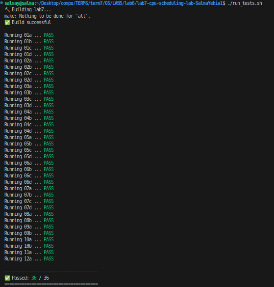

# CPU Scheduling Algorithms

This repository contains C++ implementations of various CPU scheduling algorithms. The project is containerized using Docker for consistent execution.

## Implemented Algorithms

1.  FCFS (First Come First Serve)
2.  RR (Round Robin)
3.  SPN (Shortest Process Next)
4.  SRT (Shortest Remaining Time)
5.  HRRN (Highest Response Ratio Next)
6.  FB-1 (Feedback where all queues have q=1)
7.  FB-2i (Feedback where all queues have q=2^i)
8.  Aging (Xinu Scheduling Policy)

## Docker Instructions

The Docker image is available on Docker Hub. 

**Docker Hub Link:** https://hub.docker.com/r/salmayehia1/cpu_scheduling

### How to use

1.  **Pull the image:**
    
    ```bash
    docker pull salmayehia1/cpu_scheduling:latest
    ```

2.  **Run the container:**
    
    ```bash
    docker run -it salmayehia1/cpu_scheduling:latest
    ```

### Test Cases Results 


